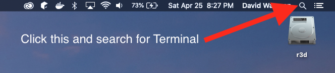
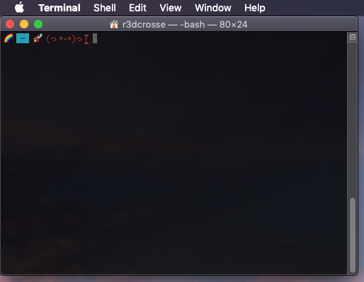
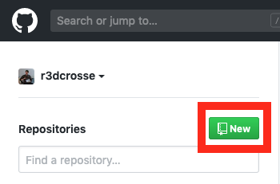
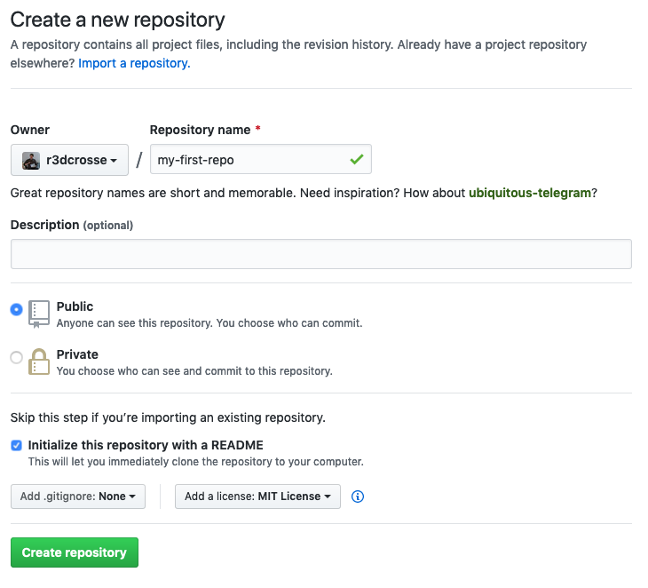
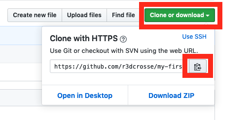
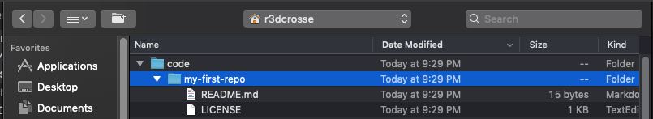
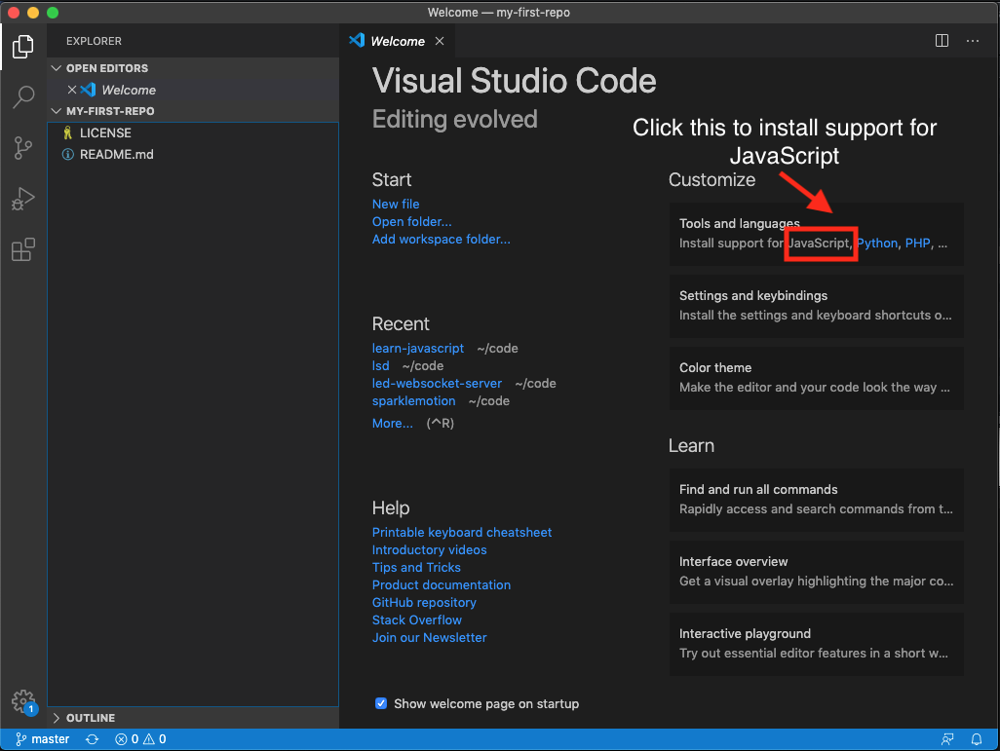
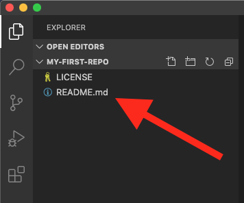
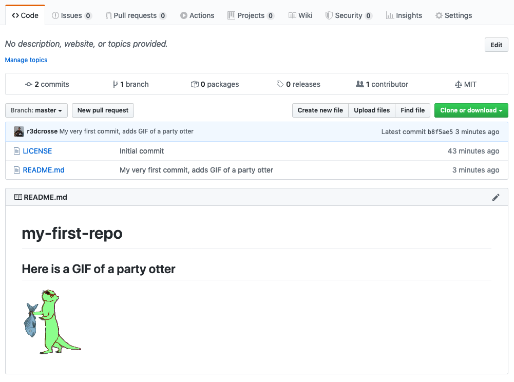

# Learn To Code
My extremely biased and opinionated guide for learning JavaScript and becoming a software engineer

## First Steps
We're going to need to download some software on your computer. I'm making the assumption that you're using a Mac or Linux. If you only have a windows computer, reach out to me and I'll see if I can put together a guide for developing on windows.

For best results, follow everything in this guide in order.

1. [Create a free account on GitHub](https://github.com/join?plan=free&source=pricing-card-free)
1. Download a free text editor. I recommend [VSCode](https://code.visualstudio.com/download)

## Intro to Terminal
On your Mac, open a new finder window, go to applications > Utilities > open up Terminal.

If you can't find it, use spotlight search on your Mac and search for Terminal.



Once the Terminal opens, it should look something like this:



Note: I've customized my Terminal using [my own custom dotfiles](https://github.com/r3dcrosse/dotfiles). Dotfiles can be a topic for something to discuss later.

### What the hell are we looking at?
We're looking at a command line we can use to do some cool things. If you want to get hella detailed, check out [Apple's user guide.](https://support.apple.com/guide/terminal/welcome/mac)

### Using the Terminal
Here are some simple commands we can type in the Terminal to get some information and do stuff. When I list commands in this guide they will look like:
```
$ somecommandhere
```
For the purposes of following this guide, do not type the `$` character. Type everything after the `$`.

### Install some more tools from Apple
We need to install xcode command line developer tools from Apple. This includes an important command we will use a lot called `git`.

Type this to install xcode command line developer tools. Note: This will open a prompt that will ask you to install. Click on the prompt and install the tools.
```
$ xcode-select --install
```

Now let's get started with some commands. Please write these down or make a note of them somewhere.

#### Print Working Directory
```
$ pwd
```
This command will output the current directory path you're in. When you enter it, you should get some
output on the terminal that looks like:
```
/Users/r3dcrosse
```
This is your current directory. For more detail, read this: [https://linuxize.com/post/current-working-directory/](https://linuxize.com/post/current-working-directory/). To quote the important info from the link:
> The current working directory is the directory in which the user is currently working in. Each time you interact with your command prompt, you are working within a directory. By default, when you log into your Linux system, your current working directory is set to your home directory. 

#### List Stuff
```
$ ls
```
This lists all the files and directories (aka folders) in your current directory.

You should see something like this when you run the command:
```
Applications/         Library/              code/
Boostnote/            Movies/               dotfiles/
Creative Cloud Files/ Music/                esp/
Desktop/              Pictures/             sparklemotion/
Documents/            Public/
Downloads/            VirtualBox VMs/
```

I should mention that this actually doesn't list _all_ files in the current directory. To do that add the `-a` flag to the command.
```
$ ls -a
```

You'll get something that looks like:
```
./                    .espressif/           Desktop/
../                   .exports@             Documents/
.CFUserTextEncoding   .gitconfig            Downloads/
.DS_Store             .gradle/              Library/
.Trash/               .jssc/                Movies/
.aliases@             .node-gyp/            Music/
.android/             .npm/                 Pictures/
.atom/                .oracle_jre_usage/    Public/
.bash_history         .ssh/                 VirtualBox VMs/
.bash_profile@        .viminfo              code/
.bash_prompt@         .vscode/              dotfiles/
.bash_sessions/       .zoomus/              esp/
.config/              Applications/         sparklemotion/
.docker/              Boostnote/
.dvdcss/              Creative Cloud Files/
```

Whoa, did you know you had a bunch of hidden files on your system? Things that Finder hides by default when viewing your current directory.

[More detail here if you're curious about it](https://linuxize.com/post/how-to-list-files-in-linux-using-the-ls-command/)

IMPORTANT DETAIL: You'll notice when you list all hidden files there are the files `./` and `../`.

`./` represents the current directory you are in.

`../` represents the parent directory.

#### Change Directory
Use this command to change the directory you are in. We can use it to navigate directories in the Terminal.

Let's go to the parent directory.
```
$ cd ..
```
Now you are in the parent directory. Use the `pwd` and `ls` commands to see where you are, and what are the contents of the directory:
```
$ pwd
```
Terminal output:
```
/Users
```
```
$ ls
```
Terminal output:
```
Shared/        r3dcrosse/
```

Now change directory to your home directory:
```
$ cd r3dcrosse
```

Now we're back to where we started. No matter what directory you're in, you can always get to your home directory by typing: `cd` and hitting enter:
```
$ cd
```

If you've gone to some other directory, go back to your home directory now for the next set of commands.

#### Make directory
To create a new folder in your current directory, use this command.
```
$ mkdir MyFolderName
```
Create a new folder called `code`:
```
$ mkdir code
```
Now change directory to the code directory:
```
$ cd code
```

## Make your first repo on GitHub
We'll come back to more Terminal commands, but first, make a repo on your GitHub:



Name your repo: `my-first-repo` and use the exact settings I have in my screenshot:



Hit the green clone button, then copy the URL listed there:



Go back to your terminal. Make sure you are still in the directory you called `code`.

Now type `git clone` and then paste the repo link and click enter.
```
$ git clone https://github.com/r3dcrosse/my-first-repo.git
```

This should download the repo to your current directory. Once it finishes, change directory to
go inside the repo you cloned.
```
$ cd my-first-repo
```

Now type `ls`to see what we have in our repo so far:
```
$ ls
```
You should see two files listed:
```
LICENSE    README.md
```

If you have VSCode installed, type: `code .` to open this git repo in VSCode:
```
$ code .
```
If this doesn't launch VSCode for you, go ahead and open up VSCode manually and find your home directory and then the repo directory:



This will open up the git repo in VSCode. While we're on the welcome screen, go ahead and install support for JavaScript:



When that's done, go ahead and click on `README.md` under the Explorer column:



This will open up the README file. This file is written in a syntax called Markdown. If you want to get familar with everything you can do with markdown read this: [https://guides.github.com/features/mastering-markdown/](https://guides.github.com/features/mastering-markdown/)

Let's go ahead and make our first change. With the readme file opened in VSCode, let's go ahead and add an image.

Edit your file so it looks like this:
```
# my-first-repo

## Here is a GIF of a party otter

```

Save the file. Go back to the Terminal, make sure you're in your git repo directory:
```
$ pwd
```
Should be:
```
/Users/r3dcrosse/code/my-first-repo
```

Now let's go ahead and check our git status. Type:
```
$ git status
```
You should get back:
```
On branch master
Your branch is up to date with 'origin/master'.

Changes not staged for commit:
  (use "git add <file>..." to update what will be committed)
  (use "git checkout -- <file>..." to discard changes in working directory)

	modified:   README.md

no changes added to commit (use "git add" and/or "git commit -a")
```

Now type:
```
$ git add README.md
```
Now check the git status again:
```
$ git status
```
You should see:
```
On branch master
Your branch is up to date with 'origin/master'.

Changes to be committed:
  (use "git reset HEAD <file>..." to unstage)

	modified:   README.md
```

Before we commit this change, we need to modify some global git settings so it
shows up as your GitHub username. We only need to do this one time ever on your
computer. Enter these set of commands, change it so it is your name, make sure to
keep the quotation marks.
```
$ git config --global user.name "David Wayman"
```
```
$ git config --global user.email "your_email_here@email.com"
```

Now let's make our very first commit. Type:
```
$ git commit -m "My very first commit, adds GIF of a party otter"
```
You should get the output:
```
[master b8f5ae5] My very first commit, adds GIF of a party otter
 1 file changed, 4 insertions(+), 1 deletion(-)
```
Now let's check the git status again:
```
$ git status
```
You should see:
```
On branch master
Your branch is ahead of 'origin/master' by 1 commit.
  (use "git push" to publish your local commits)

nothing to commit, working tree clean
```

Now let's go ahead and push these changes up to GitHub.

```
$ git push
```
You should get the output:
```
Enumerating objects: 5, done.
Counting objects: 100% (5/5), done.
Delta compression using up to 4 threads
Compressing objects: 100% (3/3), done.
Writing objects: 100% (3/3), 425 bytes | 425.00 KiB/s, done.
Total 3 (delta 0), reused 0 (delta 0)
To https://github.com/r3dcrosse/my-first-repo.git
   584fb7f..b8f5ae5  master -> master
```

Now go look at your repo on GitHub, refresh the page and you should see a party otter that got added to your readme:



Congratulations! You just made your very first step to becoming a software engineer -- you made your first commit and published the changes for the whole world to see!

Now, let's install some more required software and tools to get started with JavaScript development.

## Install Homebrew

Homebrew is a package manager that will let us easily install tools and any package we will need.
Follow the installation instructions on the Homebrew website to install it: [https://brew.sh/](https://brew.sh/)

Make sure to follow the prompts when homebrew is installing. It will ask you for the password of your computer to finish installing. Go ahead and enter the password of your computer when it asks for it.

## Install Node.js

Once Homebrew is installed, install Node.js. Use this exact command to install it:
```
$ brew install node
```

Once that finishes, verify Node.js is installed by typing:
```
$ node -v
```
You should get back the exact version of Node.js installed.

Node.js also installs its own package manager called `npm`. Verify this is installed by typing:
```
npm -v
```
You should get back the exact version that is installed.

# Let's Code!

Now that everything we need is installed, reach out to me to schedule a one-on-one Zoom session
where we can go over some basics of programming in JavaScript.